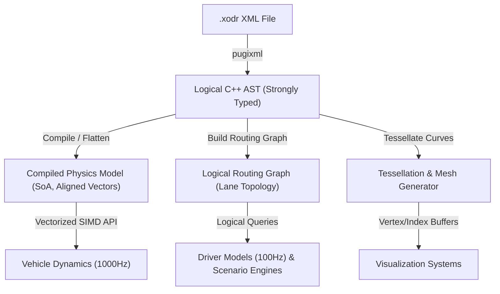

# Strada Domain Context

Strada is a high-performance, modern C++20 library for the ASAM OpenDRIVE 1.9 format. It loads `.xodr` files losslessly into a strongly-typed in-memory AST and compiles it into specialized, query-specific representations (such as a cache-friendly flat physics model and a topological routing graph) to serve real-time vehicle dynamics, driver models, scenario engines, and rendering systems.

## Domain Glossary

When writing code, documentation, or issues for Strada, always adhere to the following domain terminology. Avoid synonyms that diverge from this glossary.

### Coordinates & Reference Frames
* **Inertial Coordinates $(X, Y, Z)$**: The global, right-handed Cartesian coordinate system of the world, following the **geographic ENU convention per ASAM OpenDRIVE 1.9.0 § 8.2**.
  * $X$: East (points to the right on a 2D plan-view map). SI units (meters).
  * $Y$: North (points "up" on a 2D plan-view map page). SI units (meters).
  * $Z$: Up (vertical height above ground; out of the 2D drawing plane in 3D). SI units (meters).
* **Track Coordinates $(s, t, h)$**: The road-relative parametric coordinate system, per ASAM OpenDRIVE 1.9.0 § 8.3:
  * $s$: Longitudinal distance along the road's **Reference Line**, starting at $s=0$. SI units (meters). **$s$ is the *plan-view projected* length, not the arc length** — the elevation profile does not change $s$.
  * $t$: Lateral offset from the reference line (positive to the left of the reference line, negative to the right). SI units (meters). **$t$ is superelevated** — the t-axis is rotated around the s-axis by the road's superelevation. Consequently $h$ is the *local* up of the (superelevated) road cross-section, not the world up.
  * $h$: Height above the road reference plane. SI units (meters). $h$ is orthogonal to the (superelevated) s/t plane; the s/t/h frame is right-handed.
* **Local Coordinates $(u, v, z)$**: A right-handed frame per ASAM OpenDRIVE 1.9.0 § 8.4, used for placing **objects and signals** (not for lanes). u=forward, v=left, z=up. Distinct from the road's s/t/h frame and not part of the CPM's pose types.
* **SI Units**: All quantities in Strada are in SI — meters for length, seconds for time, **radians for angles** (never degrees), kilograms for mass. The library never accepts or returns degrees at any boundary.

### Poses
* **Pose**: A 6-DoF rigid-body state — 3-DoF position + 3-DoF orientation — expressed in a single coordinate system. The CPM exposes three flat pose types: **Inertial Pose** (world), **Road Pose** (road's s/t/h frame), and **Lane Pose** (the road's frame translated along `t`). Each is a single struct with all 6 DoF as direct members; the library has **no** `*Position` or `*Orientation` sub-types on the public surface.
* **Inertial Pose** `InertialPose`: `(x, y, z)` in the world ENU frame + `(heading, pitch, roll)` of the pose holder in the world frame. The `z` component is the height above ground.
* **Road Pose** `RoadPose`: `(s, t, h)` in the road's track frame + `(heading, pitch, roll)` of the pose holder in the road's local frame + `RoadId`.
* **Lane Pose** `LanePose`: `(s, t, h)` in the lane's track frame + `(heading, pitch, roll)` of the pose holder in the lane's local frame + `RoadId` + `LaneId`. The `h` component is the height relative to the lane's elevated surface (which includes lane-specific height offsets), unlike `RoadPose` which is relative to the road's base surface.
* **Pose holder's orientation in a frame**: The orientation fields in a `RoadPose` / `LanePose` / `InertialPose` describe the *pose holder's* orientation in that frame's coordinates, not the frame's orientation in the world. A pose aligned with its frame has `heading = pitch = roll = 0`.
* **Euler Orientation**: A 3-angle orientation representation — heading, pitch, roll (Tait-Bryan angles, **intrinsic body-axis Z-Y-X order** per ASAM OpenDRIVE 1.9.0 § 8.2). The three rotations are applied **in order: heading, then pitch, then roll**, with each successive rotation taken about the body axis produced by the previous one — *not* about the world axis. The resulting rotation matrix that carries a body-frame vector into the world frame is `R = R_z(heading) · R_y(pitch) · R_x(roll)`. Strada uses this representation throughout the CPM. **Never** quaternions or rotation matrices on the public API. SI units: **radians**.
* **Heading**: Rotation about the vertical (Z) axis. Right-hand rule. `0` = along +X, `+π/2` = along +Y (per § 8.2).
* **Pitch**: Rotation about the lateral (Y') axis, body-axis (after heading). `0` = level, `+π/2` = nose-down (per § 8.2).
* **Roll**: Rotation about the longitudinal (X'') axis, body-axis (after heading and pitch). Right-hand rule. `0` = level, `+π/2` = right-side-up becomes right-side-down (per § 8.2).
* **Pitch in the road frame**: ASAM OpenDRIVE 1.9.0 § 8.3 states *"For the s/t/h coordinate system no pitch is possible."* The road's s/t/h frame only carries 2-DoF orientation (heading from tangent + roll/superelevation around s). The road's **natural pitch** is derived from the elevation profile gradient at the reference line: `pitch_road(s) = atan(d_elev(s)/ds)`, ignoring lateral variations from superelevation twist or shape profiles. The `pitch` field in `RoadPose` is the **pose holder's offset** from the road's natural pitch. `RoadToInertial` composes the road's natural orientation (heading from tangent, pitch from elevation gradient, roll from superelevation) with the input pose's offsets, yielding the world-frame `InertialPose`. A `RoadPose = {0, 0, 0, 0, 0, 0, road}` therefore yields the road's *natural* pose, which is the right default for inspection.

### Coordinate Transformations
* The CPM exposes **all six** pairwise transformations between the three pose types. Naming follows `FromTo`, the first pose's coordinate frame → the second's. Every hot-path method takes a `QueryContext&`; inspection methods are stateless.
  * `RoadToInertial(RoadPose, QueryContext&) → InertialPose` — track-to-world, always succeeds. Composes the road's natural orientation (heading + pitch from elevation + roll from superelevation) with the input pose's offsets.
  * `InertialToRoad(InertialPosition, QueryContext&) → std::optional<RoadPose>` — world-to-track, may fail (point off the map). Searches via the spatial index, then converts orientation back to road-frame.
  * `LaneToInertial(LanePose, QueryContext&) → InertialPose` — lane-to-world, always succeeds. The lane's frame is the road's frame translated along `t`; orientation composition is the same as `RoadToInertial`.
  * `InertialToLane(InertialPosition, QueryContext&) → std::optional<LanePose>` — world-to-lane, may fail. Composed of `InertialToRoad` + `RoadToLane`.
  * `LaneToRoad(LanePose, QueryContext&) → RoadPose` — lane-to-track, always succeeds. Translates the position in both `t` (by adding lane center offset) and `h` (by adding lane height offset); orientation is unchanged (a lane is always on its road, in the same frame).
  * `RoadToLane(RoadPose, QueryContext&) → std::optional<LanePose>` — track-to-lane, may fail (point may be on a marking, shoulder, or between lanes). Walks the road's lane tree.
* The three *forward, deterministic* transformations are pure math on the input pose and carry no lookup cost. The three *inverse / cross* transformations involve a search — `InertialTo*` uses the spatial index, `RoadToLane` walks the road's lane tree — and return `std::nullopt` on failure.

### Query Conventions
* **`QueryContext`**: A small consumer-owned value type that carries the state needed to exploit *temporal coherence* across queries on the same road (last `RoadId`, last `s`-range, last segment, last BVH node). One instance per thread of execution, typically declared `thread_local` at the top of the simulation loop. Default-constructed `QueryContext` is "empty" — the first query is a full lookup, subsequent queries in temporal proximity hit the fast path. v1 is single-query only; batch APIs are not exposed.
* **Hot-path queries are stateful.** They take a `QueryContext&` parameter, are marked `noexcept`, and are designed to be aggressively inlined. Sharing a `QueryContext` across threads is undefined behavior (the consumer's responsibility).
* **Inspection queries are stateless.** `RoadCount()`, `RoadIdFromString()`, `OriginalRoadId()`, `RoadLength()`, `LaneCount()`, `LaneRoad()`, `OriginalLaneId()`, `LaneWidth()` do not take a `QueryContext&`. They are setup / debug / tooling queries, not on the 1 kHz hot path.

### Error Handling
* **Build may throw.** `BuildCompiledPhysicsModel(const ast::AbstractSyntaxTree&)` can throw on resource exhaustion or unrecoverable internal errors. The CPM does **not** perform AST validation — the parser/AST layer is responsible for input well-formedness, and the CPM trusts its input.
* **Hot-path queries are `noexcept`.** All `RoadToInertial`, `LaneToInertial`, `InertialToRoad`, `InertialToLane`, `RoadToLane`, `LaneToRoad` methods are marked `noexcept`. Failure modes for the inverse / cross queries are communicated via `std::optional<...>` (returns `std::nullopt` on failure), never via exceptions.

### Threading Model
* **CPM internal data is immutable after construction.** Once `BuildCompiledPhysicsModel` returns, every byte of the `CompiledMap` is read-only. There are no locks, no atomics, no mutable state inside the CPM.
* **Per-thread `QueryContext` is the only mutable state** and is consumer-owned. One `QueryContext` per thread of execution (`thread_local` is the dominant pattern). Sharing a `QueryContext` across threads is undefined behavior.
* **Hot-path reads are lock-free and wait-free.** A `RoadToInertial(rp, ctx)` call from any thread touches only the immutable `CompiledMap` and the calling thread's `QueryContext`. Two threads can call the same `CompiledMap`'s hot-path methods concurrently with no synchronization.

### Road Elements
* **Reference Line**: The mathematical foundation of a road, defined by continuous parametric curves (lines, clothoids/spirals, polynomials, parametric cubics) along which $s$ is measured.
* **Road**: A network segment containing a single reference line, containing one or more **Lane Sections**.
* **Lane Section**: A longitudinal slice of a road where the number and type of lanes are constant.
* **Lane**: A travel path parallel to the reference line. Lanes are indexed:
  * Left lanes have positive indices (counting outward from the center lane).
  * Right lanes have negative indices (counting outward from the center lane).
  * The center lane is always index `0` and does not allow travel.
* **Junction**: An intersection where multiple roads connect via specific incoming/outgoing road links.
* **Cross Section Surface**: A representation of the road's lateral profile (mutually exclusive with superelevation and road shape profiles) defined by lateral strips. The height of the road surface at any point within a strip is defined by a polynomial in the lateral coordinate $t$, whose coefficients are themselves piecewise polynomials in the longitudinal coordinate $s$.

### System Components
* **AST (Abstract Syntax Tree)**: The strongly-typed C++ object hierarchy that mirrors the complete OpenDRIVE 1.9 XML schema exactly (represented by `ast::AbstractSyntaxTree`), including a `struct Extensions` member on every major node to hold custom/unknown data losslessly.
  * **Lossless XML Preservation**: `Extensions` captures unknown XML attributes as a `std::map<std::string, std::string>` and each `<userData>` child element as a raw XML string in a `std::vector<std::string>`.
  * **Format-agnostic input convention**: The AST's typed fields are the OpenDRIVE shape, because that's the only input format Strada supports today. When other input formats are added (NDS, lanelet2, OSI, …), any format-specific data that doesn't fit the OpenDRIVE shape goes into `Extensions` — the same mechanism that already carries OpenDRIVE vendor extensions. This keeps a single AST type as the input to all downstream layers (CPM, Routing Graph, Tessellator) regardless of the source format.
* **CPM (Compiled Physics Model)**: A memory-aligned, contiguous Struct-of-Arrays (SoA) layout that flattens reference geometry and profiles for high-speed evaluation.
  * **Full-SoA principle**: The CPM is **fully SoA throughout** — no ragged nested structures, no pointer-chasing through `std::vector`s of vectors. Every datum the hot path touches lives in a flat array; navigation uses pre-computed offset tables, not runtime lookups. If a concept cannot be efficiently represented in flat SoA, it does **not** belong in the CPM — it stays in the AST or a different layer. This is a non-negotiable design principle; the CPM exists *because* of this flattening, and a partial commitment to SoA would not justify a separate compiled layer over the AST.
  * **Geometry Compilation**: Pre-converts deprecated `<poly3>` cubic curves into `<paramPoly3>` or piecewise arc-line segments during compilation to ensure O(1) constant-time evaluation.
  * **Fast Spiral Math**: Approximates Fresnel integrals using fast rational functions to keep spiral (clothoid) calculations branch-free and vectorized.
  * **Bivariate Shape Cache**: Optimizes road shape evaluation using contiguous shape-station lookup tables, bypassing it entirely for roads that only use standard superelevation.
* **Routing Graph**: A directed topological graph mapping lane-to-lane connections (predecessor/successor links and junction paths) for navigation.
* **Tessellator**: A geometry generator that samples mathematical curves to construct 3D polylines and meshes (vertex/index buffers) for visualization.
* **Layer**: A downstream representation of the OpenDRIVE map (CPM, Routing Graph, Tessellator, …) built from the AST through a `Build*` factory. Each layer is independent and self-sufficient; it does **not** hold pointers or references into the AST.
* **Build Factory**: A uniform `Build*` free function that constructs a layer from its upstream input. Each factory takes the upstream artifact by `const` reference and returns the new layer by value, fully owning its data. The `Build*` factories are individually composable. A future Map Facade is planned to orchestrate them in a single call, but does not change the per-layer contract.
* **Map Facade** (planned, not yet designed): A single entry point that chains the `Build*` factories from a `.xodr` file and presents the resulting layers together. The individual `Build*` factories remain the source of truth; the facade is convenience, not a wrapper that adds policy.

---

## System Architecture

### 1. The Parser & AST
Exposes the exact logical model of the XML file. Retains unknown/custom XML extensions to maintain a lossless loading model. It is optimized for structural inspection and startup configuration, not real-time query loops.

### 2. The Compiled Physics Model (CPM)
An immutable, cache-localized data representation. Geometry parameters (reference lines, lane width polynomials, elevations, and lateral profiles) are compiled into contiguous, SIMD-aligned float/double arrays (SoA).
* **Geometry Queries**: Evaluates coordinates and properties ($X, Y, Z \leftrightarrow s, t, h$) via a thread-safe, reentrant API.
* **Spatial Index**: Uses a flat Bounding Volume Hierarchy (BVH) stored contiguously in memory for fast $O(\log N)$ road/lane lookup by coordinates.
* **SIMD Batch Queries**: Exposes an API taking `std::span` arguments to evaluate multiple coordinates concurrently (e.g. 4 wheel contact points) utilizing vector registers.

### 3. The Logical Routing Graph
Maintains topological connectivity of lanes through road transitions and junctions, allowing Dijkstra or A* pathfinding queries.

### 4. Tessellator & Mesh Generator
Computes discrete polylines and triangulations of road surfaces, lane markings, and boundaries with a user-configurable chord error tolerance (e.g., $1\text{ cm}$ chord error for high-precision tire-road contact vs $50\text{ cm}$ for rendering).

---

## Project Directory & Tooling Layout

Strada follows the **Pitchfork Layout** for C++ project organization and integrates automated tooling for testing, performance evaluation, and style checks:

* **`include/strada/`**: Public API headers, organized into subdirectories:
  * `include/strada/ast/` — AST node types (`header.hpp`, `road.hpp`, `junction.hpp`, `extensions.hpp`, etc.)
  * `include/strada/parser/` — Parser entry points (`parser.hpp`) and exception types (`errors.hpp`).
* **`src/`**: Private source files and internal implementations.
* **`tests/`**: Unit and integration test suites using **GoogleTest & GoogleMock**.
  * `tests/data/` — `.xodr` fixture files loaded by tests (no inline XML strings in test code).
* **`benchmark/`**: Micro-benchmarks using **Google Benchmark** to protect the physics time budget.
* **`CMakeLists.txt`**: Configured to retrieve and build dependencies automatically via CMake `FetchContent` (using `FIND_PACKAGE_ARGS` to look up local system packages first).
* **ClangFormat & ClangTidy**: Enforces strict C++ code styling and static analysis across all source files.
* **cmake-format**: Enforces consistent formatting of all CMake files (`CMakeLists.txt` and `*.cmake`). Must be run after every CMake file modification.
* **Code & Test Conventions**: All header files use `#pragma once`, primitive types are brace-initialized (`{}`), standard container classes default-initialize without `{}` (to prevent redundancy warnings), and all tests follow the Arrange-Act-Assert (AAA) pattern.
* **Error Handling**: Parser errors are communicated via a typed exception hierarchy (`ParseError` → `XmlParseError`, `MissingElementError`, `InvalidAttributeError`) defined in `include/strada/parser/errors.hpp`.
