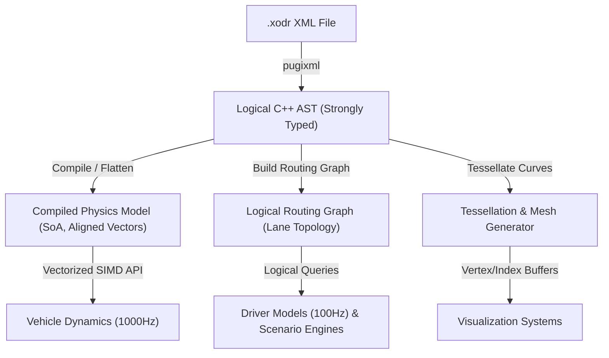

# Strada Domain Context

Strada is a high-performance, modern C++20 library for the ASAM OpenDRIVE 1.9 format. It loads `.xodr` files losslessly into a strongly-typed in-memory AST and compiles it into specialized, query-specific representations (such as a cache-friendly flat physics model and a topological routing graph) to serve real-time vehicle dynamics, driver models, scenario engines, and rendering systems.

## Domain Glossary

When writing code, documentation, or issues for Strada, always adhere to the following domain terminology. Avoid synonyms that diverge from this glossary.

### Coordinates & Reference Frames
* **Inertial Coordinates $(X, Y, Z)$**: The global, right-handed Cartesian coordinate system of the world.
* **Track Coordinates $(s, t, h)$**: The road-relative parametric coordinate system:
  * $s$: Longitudinal distance along the road's **Reference Line** (starting at $s=0$).
  * $t$: Lateral offset from the reference line (left is positive, right is negative).
  * $h$: Height above the road reference plane.
* **Local Coordinates**: Coordinate frame centered on a specific lane or object.

### Road Elements
* **Reference Line**: The mathematical foundation of a road, defined by continuous parametric curves (lines, clothoids/spirals, polynomials, parametric cubics) along which $s$ is measured.
* **Road**: A network segment containing a single reference line, containing one or more **Lane Sections**.
* **Lane Section**: A longitudinal slice of a road where the number and type of lanes are constant.
* **Lane**: A travel path parallel to the reference line. Lanes are indexed:
  * Left lanes have positive indices (counting outward from the center lane).
  * Right lanes have negative indices (counting outward from the center lane).
  * The center lane is always index `0` and does not allow travel.
* **Junction**: An intersection where multiple roads connect via specific incoming/outgoing road links.

### System Components
* **AST (Abstract Syntax Tree)**: The strongly-typed C++ object hierarchy that mirrors the complete OpenDRIVE 1.9 XML schema exactly, including a metadata map to hold custom/unknown attributes losslessly.
  * **Lossless XML Preservation**: AST elements capture custom attributes as flat key-value pairs and nested XML elements (such as `<userData>` sub-trees) as raw string fragments/DOM sub-trees.
* **CPM (Compiled Physics Model)**: A memory-aligned, contiguous Struct-of-Arrays (SoA) layout that flattens reference geometry and profiles for high-speed evaluation.
  * **Geometry Compilation**: Pre-converts deprecated `<poly3>` cubic curves into `<paramPoly3>` or piecewise arc-line segments during compilation to ensure O(1) constant-time evaluation.
  * **Fast Spiral Math**: Approximates Fresnel integrals using fast rational functions to keep spiral (clothoid) calculations branch-free and vectorized.
  * **Bivariate Shape Cache**: Optimizes road shape evaluation using contiguous shape-station lookup tables, bypassing it entirely for roads that only use standard superelevation.
* **Routing Graph**: A directed topological graph mapping lane-to-lane connections (predecessor/successor links and junction paths) for navigation.
* **Tessellator**: A geometry generator that samples mathematical curves to construct 3D polylines and meshes (vertex/index buffers) for visualization.

---

## System Architecture

### 1. The Parser & AST
Exposes the exact logical model of the XML file. Retains unknown/custom XML extensions to maintain a lossless loading model. It is optimized for structural inspection and startup configuration, not real-time query loops.

### 2. The Compiled Physics Model (CPM)
An immutable, cache-localized data representation. Geometry parameters (reference lines, lane width polynomials, elevations, and lateral profiles) are compiled into contiguous, SIMD-aligned float/double arrays (SoA).
* **Geometry Queries**: Evaluates coordinates and properties ($X, Y, Z \leftrightarrow s, t, h$) via a thread-safe, reentrant API.
* **Spatial Index**: Uses a flat Bounding Volume Hierarchy (BVH) stored contiguously in memory for fast $O(\log N)$ road/lane lookup by coordinates.
* **SIMD Batch Queries**: Exposes an API taking `std::span` arguments to evaluate multiple coordinates concurrently (e.g. 4 wheel contact points) utilizing vector registers.

### 3. The Logical Routing Graph
Maintains topological connectivity of lanes through road transitions and junctions, allowing Dijkstra or A* pathfinding queries.

### 4. Tessellator & Mesh Generator
Computes discrete polylines and triangulations of road surfaces, lane markings, and boundaries with a user-configurable chord error tolerance (e.g., $1\text{ cm}$ chord error for high-precision tire-road contact vs $50\text{ cm}$ for rendering).

---

## Project Directory & Tooling Layout

Strada follows the **Pitchfork Layout** for C++ project organization and integrates automated tooling for testing, performance evaluation, and style checks:

* **`include/strada/`**: Public API headers (e.g., `include/strada/ast.hpp`).
* **`src/`**: Private source files and internal implementations.
* **`tests/`**: Unit and integration test suites using **GoogleTest & GoogleMock**.
* **`benchmark/`**: Micro-benchmarks using **Google Benchmark** to protect the physics time budget.
* **`CMakeLists.txt`**: Configured to retrieve and build dependencies automatically via CMake `FetchContent` (using `FIND_PACKAGE_ARGS` to look up local system packages first).
* **ClangFormat & ClangTidy**: Enforces strict code styling and linting checks across all source files.
* **Code & Test Conventions**: All header files use `#pragma once`, primitive types are brace-initialized (`{}`), standard container classes default-initialize without `{}` (to prevent redundancy warnings), and all tests follow the Arrange-Act-Assert (AAA) pattern.
